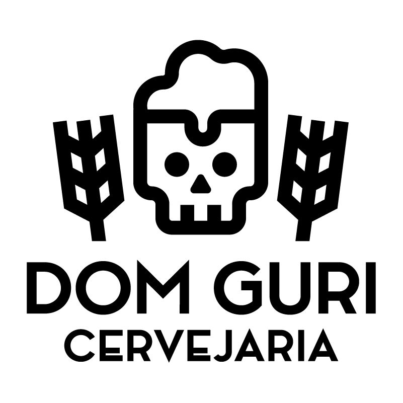

Nome do Projeto: Cervejaria DOM GURI

Versão: 1.0

Data:08/02/2025

Nome Integrantes:Eduardo Rossetti, 
Giselly Zamboni, 	 	   
Lucas Molozzi Mantelli, Yuri Magnan

# 1\. Introdução

## Minimundo: Sistema de Vendas de Cerveja  

A cervejaria **DOM GURI** tem como objetivo criar um sistema de vendas que facilite o acesso dos clientes aos produtos, amplie o alcance das vendas e proporcione uma experiência de compra personalizada e interativa, tudo isso em um ambiente simples e dinâmico.  

Para atingir esses objetivos, o sistema contará com um **catálogo de produtos**, exibindo uma lista das cervejas e demais produtos disponíveis com imagens e descrições detalhadas das características, como ingredientes, teor alcoólico e sugestões para consumo, por exemplo.  

Os **administradores do sistema** poderão gerenciar esse catálogo, realizando o cadastro, edição e remoção de produtos, além de controlar a disponibilidade dos mesmos.  

Durante o **processo de compra**, o cliente poderá:  
- Adicionar mais de um produto ao seu carrinho;  
- Ajustar a quantidade e remover itens antes da finalização do pedido;  
- Realizar a reserva simultânea de diferentes cervejas no site para retirada presencialmente.  

Para proporcionar uma melhor experiência e segurança ao cliente, o sistema contará também com um **cadastro de login**, no qual os clientes poderão:  
- Criar suas contas;  
- Visualizar os históricos de pedidos;  
- Atualizar suas informações pessoais se necessário;  
- Acompanhar suas compras.  

Para a **gestão administrativa**, o sistema poderá gerar **relatórios básicos**, apresentando dados como:  
- Total de vendas por período;  
- Produtos mais vendidos;  
- Status dos pedidos.  

Essas informações ajudarão os administradores a **monitorar o desempenho das vendas** e identificar oportunidades de melhoria no empreendimento.  

## 1\.1 Objetivo

O objetivo deste projeto é desenvolver um sistema de catalogamento, venda de produtos (cervejas artesanais, canecas, camisetas e outros itens relacionados) e divulgação de eventos para a Cervejaria DOM GURI. O sistema visa:  
- Facilitar o gerenciamento de produtos e estoque.  
- Oferecer uma plataforma de e-commerce para venda online.  
- Promover eventos e participações da cervejaria em feiras e festivais.  
- Melhorar a experiência do cliente, proporcionando acesso fácil a informações sobre produtos e eventos.

## 1\.2 Escopo

Este projeto visa desenvolver um sistema web e mobile para a Cervejaria DOM GURI, que terá como finalidade:  
- Catalogar e gerenciar produtos (cervejas artesanais, itens promocionais, etc.).  
- Permitir a venda online desses produtos.  
- Divulgar eventos e participações da cervejaria.  
- Fornecer uma interface intuitiva para clientes e administradores.  
O sistema se destina a:
- Clientes: Pessoas interessadas em comprar produtos da cervejaria e acompanhar eventos.  
- Administradores: Equipe da DOM GURI responsável pelo gerenciamento de produtos, vendas e eventos.  

## 1\.3 Definições, Acrônimos e Abreviações

- DOM GURI: Nome da cervejaria artesanal.  
- E-commerce: Plataforma de venda online.  
- MVP (Minimum Viable Product): Versão inicial do sistema com funcionalidades essenciais.

## 1\.4 Público-alvo

Este documento destina-se a:
- Equipe de desenvolvimento do sistema.
- Gerentes e proprietários da Cervejaria DOM GURI.
- Clientes e usuários finais do sistema.
- Parceiros e fornecedores envolvidos no projeto
