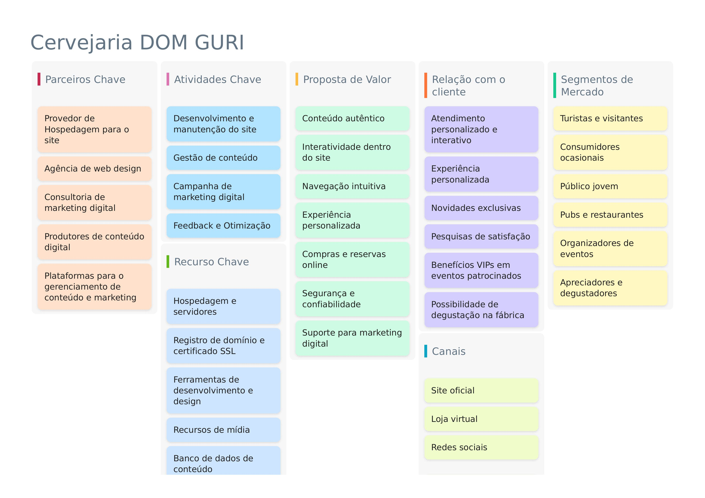
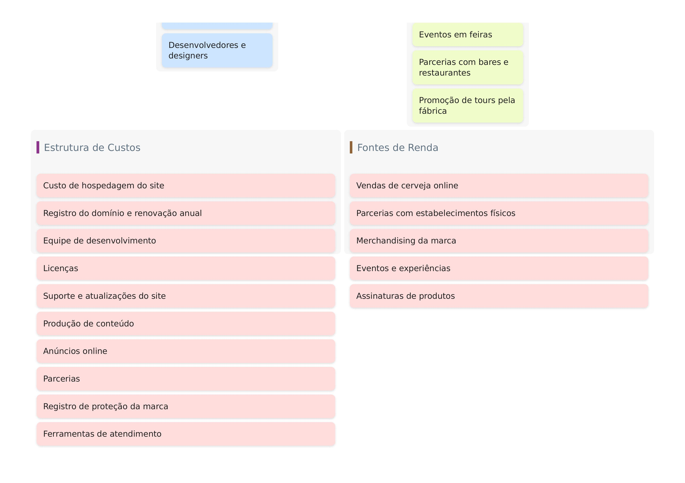

# 2\. Descrição do Projeto

## 2\.1 Visão Geral do Projeto

O sistema da Cervejaria DOM GURI será uma plataforma integrada para:  
- Catalogamento de produtos: Cadastro, edição e exclusão de cervejas, canecas, camisetas e outros itens.  
- Venda online: Integração com gateways de pagamento e gestão de pedidos.  
- Divulgação de eventos: Publicação de datas, locais e detalhes de eventos onde a cervejaria estará presente.  
- Relatórios e análises: Geração de relatórios de vendas, estoque e participação em eventos.  

## 2\.1\.1 Canvas

## 2\.2 Stakeholders 
- Equipe DOM GURI: Responsável pelo gerenciamento de produtos, vendas e eventos.  
- Clientes: Consumidores finais que compram produtos e acompanham eventos.  
- Desenvolvedores: Equipe responsável pela implementação do sistema.  
- Fornecedores: Parceiros que fornecem insumos para a produção de cervejas e itens promocionais.  
- Parceiros de eventos: Organizadores de feiras e festivais onde a DOM GURI participa. 
