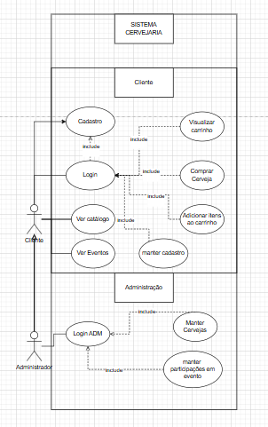

# 4.1 Descrição de Caso de Uso  

1. **Caso de Uso: Cadastro de Eventos**  
   - **Ator**: Administrador.  
   - **Descrição**: O administrador pode criar, editar ou excluir eventos, informando dados como data, local, descrição e imagens.  

2. **Caso de Uso: Reserva de Produtos**  
   - **Ator**: Cliente.  
   - **Descrição**: O cliente pode reservar um produto para retirada posterior, garantindo disponibilidade.  

3. **Caso de Uso: Reserva de Eventos**  
   - **Ator**: Cliente.  
   - **Descrição**: O cliente pode realizar uma reserva para participação em um evento, garantindo sua vaga.  

4. **Caso de Uso: Gerenciamento de Cervejas**  
   - **Ator**: Administrador.  
   - **Descrição**: O administrador pode criar, editar e excluir cervejas, informando nome, tipo, teor alcoólico e outras informações relevantes.